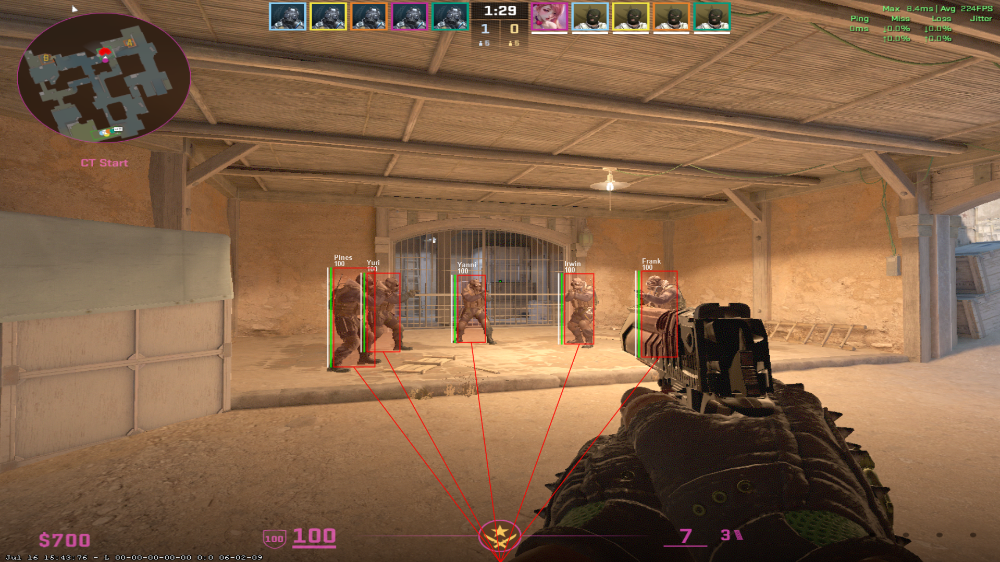
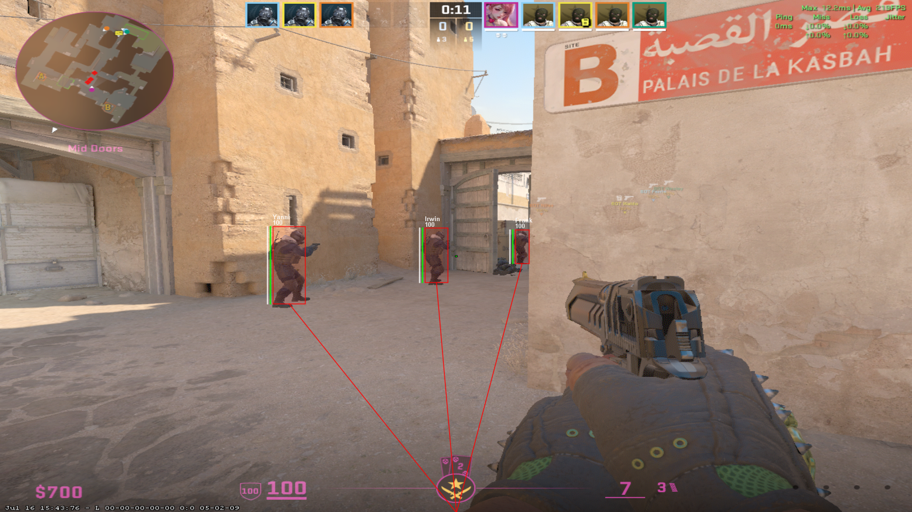

# CS2 External ESP Overlay

Just a pet project, poor feature and no GUI. This using java awt to drawing buffer image frame by frame so it very weird FPS, anyway I just make it for fun.

*You will get VAC Ban immediately without -insecure flag at steam launch property because it still using Windows API to read another process memory(via JNA).*

> ->**never cheating in any multiplayer game :)** 

## Basic ESP feature

 - [x] ESP box
 - [x] Health & Armor bar
 - [x] Player name & health
 - [x] Line to box(snap line)

## Build & Run
By default this is will directly running if you just simply press RUN button, so have few ways to build it. I using VS Code so this is my way :)
### First
add to pom.xml(if using Maven like me)

    <dependency>
        <groupId>net.java.dev.jna</groupId>
        <artifactId>jna</artifactId>
        <version>VERSION</version>
    </dependency>
    <dependency>
        <groupId>net.java.dev.jna</groupId>
        <artifactId>jna-platform</artifactId>
        <version>VERSION</version>
    </dependency>
### Second

    In VS Code, left click to Terminal(in the top left bar) > select "Run Task..." > then select "java(buildArtifact)" > select "java (buildArtifact): CS2-Java-External-ESP"
After task run done, it will create a .jar file at project folder, now if you wanna make it to an .exe file you need using a third party tool like Launch4J, you can explore it by yourself, I'm done here.

## Demo

